

<h1>基于 PatchTST 与 Temporal Fusion Transformer 的逐时负荷预测：与传统 Boosting 方法（CatBoost）及 N-HiTS 神经网络模型的对比系统分析</h1>

用于对比分析逐时电力负荷预测模型的信息系统：PatchTST、Temporal Fusion Transformer (TFT)、N-HiTS 和 CatBoost。包含数据预处理、模型训练、验证及结果可视化，旨在为电力市场决策提供支持。

&nbsp;&nbsp;

&nbsp;&nbsp;

 

&nbsp;&nbsp;

&nbsp;&nbsp;

  &nbsp;&nbsp;&nbsp;&nbsp;&nbsp;&nbsp;&nbsp;&nbsp;
  <a href="https://github.com/KEV0143/Comparative-analysis-of-hourly-load-forecasting-using-PatchTST-TFT-NHiTS-and-CatBoost/blob/main/README.md" style="text-decoration: none;">
    <b>Русская локализация</b>
  </a>
  &nbsp;&nbsp;&nbsp;&nbsp;|&nbsp;&nbsp;&nbsp;&nbsp;
  <a href="https://github.com/KEV0143/Comparative-analysis-of-hourly-load-forecasting-using-PatchTST-TFT-NHiTS-and-CatBoost/blob/main/README.EN.md" style="text-decoration: none;">
    <b>English Localization</b>
  </a>
  &nbsp;&nbsp;&nbsp;&nbsp;|&nbsp;&nbsp;&nbsp;&nbsp;
  <a href="https://github.com/KEV0143/Comparative-analysis-of-hourly-load-forecasting-using-PatchTST-TFT-NHiTS-and-CatBoost/blob/main/README.zh-CN.md" style="text-decoration: none;">
    <b>中文本地化</b>
  </a>

  
  
  
  
  

  <b>A. E. 兹戈耶夫, E. V. 克里姆金, V. V. 切尔尼亚乌斯卡斯, A. V. 布莱洛夫斯基, R. N. 雷津科夫</b>
   
  <i>MIREA – 俄罗斯技术大学</i>
   
  <i>119454，俄罗斯，莫斯科，韦尔纳茨基大街 78 号</i>

  <i>俄罗斯科学院卡巴尔达-巴尔卡尔科学中心通报. 2026. 卷 28. 期 3. 页 49–70.</i>
   
  <b>DOI:</b>
  <a href="https://doi.org/10.35330/1991-6639-2026-28-3-49-70">
    10.35330/1991-6639-2026-28-3-49-70
  </a>
   
  <b>UDC:</b> 519.876.5.7:621.311+004.032.26+004.85
  <b>MSC:</b> 93A30; 68T05; 62M20  
  <b>收稿日期:</b> 2026-04-01，<b>审回修改:</b> 2026-05-04，<b>接受发表:</b> 2026-06-11

<h3>科研合作</h3>

作者非常欢迎与高校、数据中心、电力企业及工业制造企业在上述模型（包括 Transformer 架构）于负荷预测领域的应用展开科研合作。

欢迎在工业与电力企业中开展模型试点项目及后续落地应用。

  <a href="mailto:Dzgoev_Alan@mail.ru">
    <b>Dzgoev_Alan@mail.ru</b>
  </a>

 
<h2 align="center" style="border-bottom: none; border: none;">引用格式</h2>

&emsp;&emsp;Dzgoev A. E., Klimkin E. V., Chernyauskas V. V., Brailovsky A. V., Rezenkov R. N. Hourly Load Forecasting Using PatchTST and Temporal Fusion Transformer: A Comparative Systems Analysis with Traditional Boosting Methods (CatBoost) and N-HiTS Neural Network Models // *News of Kabardino-Balkarian Scientific Center of RAS*. 2026. Vol. 28. No. 3. Pp. 49–70. DOI: 10.35330/1991-6639-2026-28-3-49-70

<h2 align="center" style="border-bottom: none; border: none;">摘要</h2>

&emsp;&emsp;在现代电力需求动态变化及外部因素影响日益复杂的背景下，传统统计自回归建模方法（ARIMA、SARIMAX）往往逐渐被机器学习算法（Gradient Boosting）及现代深度学习架构（Transformers）所取代。

&emsp;&emsp;**研究目的** – 旨在解决在信息有限的条件下，利用现代机器学习和深度学习方法（CatBoost、Temporal Fusion Transformer (TFT)、PatchTST、N-HiTS）选择未来一日逐时用电量最佳预测模型的问题。

&emsp;&emsp;**材料与方法。** 程序代码采用 Python 编写，已在 GitHub 开源平台发布，地址为：https://github.com/KEV0143/Comparative-analysis-of-hourly-load-forecasting-using-PatchTST-TFT-NHiTS-and-CatBoost。

&emsp;&emsp;**结果。** 在所考查的每种方法框架下，均开发出了用于用电量预测的新型优质且适用的数学模型。一项重要的数学成果在于：将解决“用于企业节能管理的用电量预测”这一问题归结为对唯一最佳模型的科学选型。无论对于现代机器学习与深度学习模型算法的理论研究，还是考虑到数据量日益增长的实际应用，这一点都具有重要意义。该任务对于优化企业及整个地区的电力消耗具有重大价值。

&emsp;&emsp;**结论。** 基于俄罗斯联邦某电力公司的真实数据，通过理论分析与计算实验，得出了关于 CatBoost 模型适用于解决企业用电成本优化任务的重要实用结论。本文得出的所有结论均得到了统计检验结果的验证。

&emsp;&emsp;**关键词：** 模型系统分析、数理统计、短期预测、用电量、对比系统分析、机器学习、深度学习、CatBoost、Temporal Fusion Transformer (TFT)、PatchTST、N-HiTS

<h2 align="center" style="border-bottom: none; border: none;">引言</h2>

&emsp;&emsp;电力消费的实时与短期预测（Short-Term Load Forecasting, STLF）是批发电力与容量市场（WECM）各参与主体的重要任务 [1]。较高的预测误差（每年可达 17%）会导致生产和电力企业因偏差罚款而面临巨大的经济损失，同时也会降低地区发电机组和电力系统运行模式规划的效率 [2, 3]。

&emsp;&emsp;在需求动态变化及外部因素影响的现代条件下，传统统计自回归建模方法（ARIMA、SARIMAX）往往逊色于机器学习算法（Gradient Boosting）和现代深度学习架构（Transformers）。本文基于俄罗斯某电力公司的真实数据，对 CatBoost、Temporal Fusion Transformer (TFT)、N-HiTS 和 PatchTST 四种现代机器学习建模方法在规律恢复与用电量预测质量方面进行了对比研究。

&emsp;&emsp;用于地区电力系统管理决策的逐时用电量建模与预测，是一项跨系统分析、机器学习、时间序列分析及电力工程领域的科学应用课题。选择最佳数学模型的复杂性在于负荷数据的非平稳、多模态和随机特性，这些数据受到众多独立变量（$X$）的影响：从气象条件、日历因素到经济活动以及用电行为特征。然而，我们坚持一种科学哲学：数学模型的本质与实用价值在于参数数量应当少于观测数据量。如果一个参数较少的数学模型能够解释大部分观测现象，且具备实用性、适用性和高质量，这本身就是一项重大的科研成就。研究人员需要验证模型在哪些数据上有效、在哪些数据上失效，这表明并不存在通用无敌的模型。

&emsp;&emsp;正因如此，全球学者持续探索、开发和对比各种数学模型及其构建方法——从统计与集成方法（ARIMA、Gradient Boosting）到现代深度学习架构（LSTM、Transformers、混合模型）——以针对特定的数据集寻找最精确和最稳健的解决方案。即使预测误差降低零点几个百分点（例如将 MAPE 从 2.5% 降至 2.0%），也会带来巨大的经济效益，尤其是对于大型大型矿冶企业和数据中心而言。对于大型工业企业而言，这意味着优化用电支付成本并减少预测偏差罚款；对于电网和发电公司而言，这意味着提高可靠性、有效规划调度模式并降低备用容量成本；对于数据中心（DC）而言，这意味着直接降低运营成本并提高能源效率 [4]。

&emsp;&emsp;对于批发电力与容量市场（WECM）的大型工业企业参与者（如生产高耗能产品的采矿冶金综合体、化工厂和汽车厂以及农业控股公司），用电量是产品成本中最主要的财务支出之一。未来一日精准的逐时预测使得此类企业能够高效参与 WECM，签订最佳合同，从而将购买所需能源的成本降至最低。预测误差要么导致在平衡市场（BM）上以高昂的现货价格购买缺额电力，要么导致以不利的价格出售过剩电力。为了激励企业精确预测，俄罗斯统一电力系统系统运营商（SO UPS）会对预测值与实际值的偏差征收罚款 [5]。

&emsp;&emsp;对于电力公司而言，精准的逐时预测是全国各地区整个电力系统安全经济运行的基础。售电公司利用预测数据制定全地区采购电量的相关信息。电网公司利用预测数据规划检修、识别电量损失（技术与管理损失）并管理电网负荷，以防止可能发生的事故（即预测性分析）。对于俄罗斯统一电力系统系统运营商而言，汇总用电量预测是制定电厂日运行曲线、确保频率稳定性和计算所需备用容量的基础。预测估算偏低可能导致容量短缺和用户断电，而预测估算偏高则会导致不必要地启动昂贵的高成本备用发电机组（如燃气轮机），这在全国范围内会导致数十亿卢布的经济损失 [6, 7]。

&emsp;&emsp;随着人工智能技术的快速发展，数据中心（DC）已成为最大的电力消耗者之一，其供电支出占总运营成本的 40–50%。准确的逐时负荷预测对数据中心在实时和战略管理中均至关重要。它能够优化冷却系统的运行（冷却系统是除 IT 设备外耗电最大的部分），并有效启用备用电源。未来，随着对“绿色”能源要求的提高，数据中心将致力于实现与本地可再生能源（太阳能电池板、风力发电机）的最大程度集成，其中自发自用预测将成为平衡微电网和降低碳足迹的必要条件 [8–10]。

&emsp;&emsp;本文课题立项的新颖性在于对现代异构用电量预测数学模型进行了综合、对比和系统分析。上述模型是采用不同的机器学习与深度学习方法，基于俄罗斯中央大区某电力企业的真实生产数据开发而成的。

<h2 align="center" style="border-bottom: none; border: none;">任务提出与现有真实用电数据的初步统计系统分析</h2>

&emsp;&emsp;本文展示了对现代机器学习和深度学习方法的系统对比分析，涵盖了截然不同的方法——从梯度提升（CatBoost）到专门针对时间序列的神经网络模型架构（N-HiTS、Temporal Fusion Transformer、PatchTST）。本研究的新颖之处在于对这些方法在工业企业电力系统管理与节能逐时用电预测实际任务中的有效性给出了科学合理的评估。

### 现有真实数据的初步统计分析

&emsp;&emsp;本研究基于俄罗斯联邦中央大区某大型电力公司一个交付点组（GTP-1）的实际用电功率（MWh）和环境温度（°C）数据展开。

#### 样本特征
&emsp;&emsp;样本总数据量为 97,177 个观测值（涵盖 2012 年至 2023 年长达 11 年以上的逐时用电量数值）。用电量数值范围在 2293.76 至 7755.18 MWh 之间。

&emsp;&emsp;对目标变量（每日各小时用电量）进行了统计计算：
* 样本均值 – 4681.33 MWh ($\pm 987.74$ MWh)；
* 中位数 – 4649.02 MWh。样本均值与中位数非常接近，表明分布相对均衡；
* 偏度 (Skewness) – 0.0896。分布呈现轻微的正偏态（向高用电量方向延伸的“拖尾”）；
* 峰度 (Kurtosis) – -0.5303；
* 标准差 – 987.74 MWh；
* 众数 – 2836.56 MWh。分布呈平顶态（platykurtic），这意味着不存在频繁发生的极端异常值，与正态（高斯）分布相比，数据在均值附近的分布更为平缓。这可用日周期性来解释：用电量定期在低谷（夜晚）和高峰（白天）之间切换；
* 四分位距 – 50% 的观测值集中在 3985 MWh 至 5400 MWh 之间。

&emsp;&emsp;对 2012-01-02 至 2023-01-31 期间 GTP-1 逐时用电数据（$n = 97,177$ 个观测值）进行的统计分析揭示了以下规律：
- *分布特征：* 图 1 中展示的用电量分布呈现出由日、周和季节周期引起的多模态分布特征 [11]。样本均值（4681.33 MWh）与中位数（4649.02 MWh）接近，表明分布具有相对对称的中央“核心”。然而需要指出的是，众数（2836.56 MWh）显著较低，这反映出存在夜间低负荷时段常见的低用电量数值；
- *偏度与峰度：* 轻微的正偏度系数（Skewness = 0.0896）表明存在由极高用电时段（如负荷尖峰）引起的弱右拖尾。负峰度（Kurtosis = -0.5303）表明该分布为平顶态（platykurtic），即与正态分布相比，概率密度曲线更加平缓，极端异常值的出现频率较低。这与学术界的研究结论一致 [12]，即长期平均的日负荷曲线由于多个周期性用电量组的叠加，往往呈现出平滑分布；
- *波动性：* 标准差（987.74 MWh）约占均值的 21%，这表明存在显著的日内波动性。四分位距（IQR ≈ 1415 MWh）证实大部分逐时用电量数值集中在中等负荷范围内，而极端数值（无论过低还是过高）都相对罕见。

  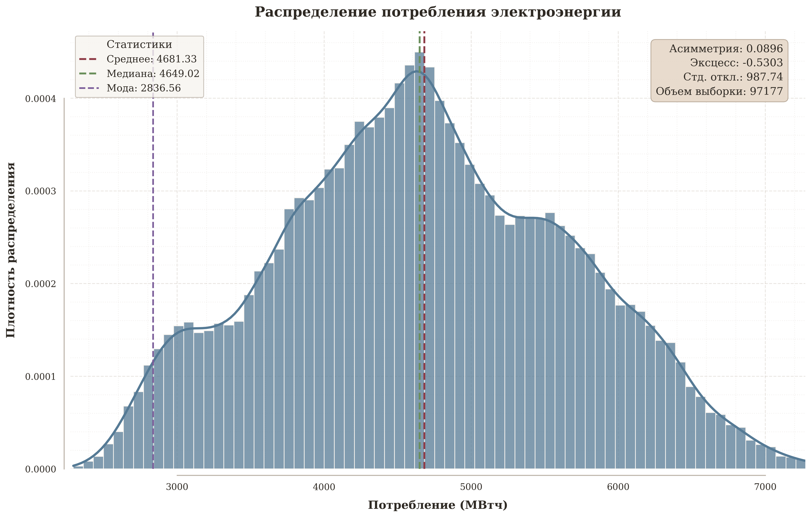
  
<b>图 1.</b> 用电量分布及初步统计分析结果 / <i>Fig. 1. Electricity consumption distribution and preliminary statistical analysis results</i>

&emsp;&emsp;对独立变量（环境温度）的数值进行了统计分析。现有温度数值具有高度变异性：从 –29.9 °C 到 +34.4 °C，这证实了考量气候因素的必要性（例如冬季使用暖风机采暖和夏季使用空调制冷）。

&emsp;&emsp;环境温度的概率分布同样为平顶态（Kurtosis = -0.5670），均值（6.84 °C）与中位数（6.30 °C）接近，且具有弱负偏度（–0.0841）。这表明分布在均值周围相对对称，并略微偏向较低温度。较宽的数值分布范围（标准差 = 10.61 °C）反映了年度气候周期。环境温度概率分布图如图 2 所示。

  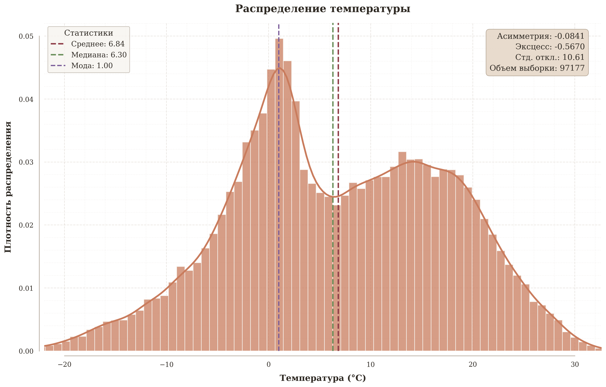
  
<b>图 2.</b> 环境温度数值分布及初步统计分析结果 / <i>Fig. 2. Ambient temperature distribution and preliminary statistical analysis results</i>

&emsp;&emsp;图 3 展示的用电量与温度时间序列图表明：
- 具有显著的日周期性，夜间为低谷，白天为高峰；
- 季节依赖性：用电量与温度密切相关。在冬季（采暖）和夏季（制冷）均观察到用电高峰，符合文献 [13] 中描述的“U 型”依赖模型；
- 长期趋势与人为效应：在周期性成分背景下，可以观察到由于经济、能源效率或用户结构变化所引起的微弱趋势 [14]。

  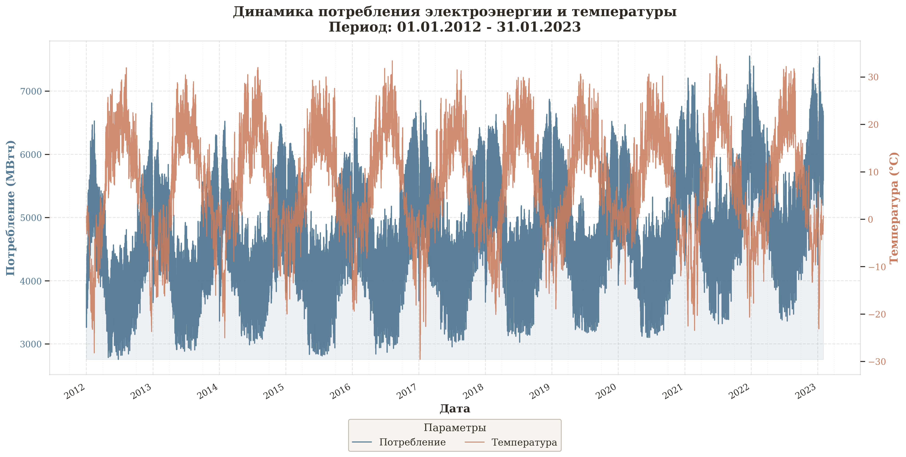
  
<b>图 3.</b> 11 年间的用电量与环境温度曲线图 / <i>Fig. 3. Energy consumption and ambient temperature graphs for 11 years</i>

&emsp;&emsp;因此，原始用电量数据表现为依赖于温度和其他因素（星期几、节假日）的非平稳多季节时间序列。这要求在建模与预测中采用能够捕捉复杂非线性依赖关系与因素相互作用的现代数学方法。

<h2 align="center" style="border-bottom: none; border: none;">用于开发未来一日逐时用电量预测候选数学模型的机器学习与深度学习方法</h2>

### 模型选型依据
&emsp;&emsp;为了解决小时级采样精度的短期负荷预测（Short-Term Load Forecasting – STLF）问题，我们选择了涵盖不同机器学习与深度学习范式的现代方法：
- **CatBoost** – 因其高效处理类别特征与时间特征的能力而被选中 [15]；
- **TFT (Temporal Fusion Transformer)** – 因其能够解释时间动态并揭示静态变量与动态变量之间复杂依赖关系的能力而被选中 [16]；
- **N-HiTS (Neural Hierarchical Interpolation for Time Series)** – 作为一种通过分层插值降低计算复杂度的现代模型而被选中，这对多步预测至关重要 [17]；
- **PatchTST** – 因其采用将序列划分为“Patch（块）”的切片机制而被选中，使 Transformer 能够更好地捕捉局部语义依赖 [18]。

&emsp;&emsp;上述选型基于以下必要性：
- 考虑负荷、温度和时间因素之间复杂的非线性相互关系；
- 识别数据中的多周期时间依赖性；
- 确保预测的可解释性与可靠性。

### 基于决策树的梯度提升方法 (CatBoost)
&emsp;&emsp;CatBoost [19] 代表了梯度提升决策树算法类，常应用于系统分析及带有类别特征的表格数据处理任务中。在负荷预测中，其优势体现在：
- 自动处理类别特征 – 高效处理诸如小时、星期几、日期类型（工作日/周末/节假日）、月份等关键因素，有助于捕捉日周期和周周期季节性；
- 抗过拟合稳定性 – 得益于有序提升（Ordered Boosting）和正则化机制；
- 可解释性 – 能够评估特征重要性（Feature Importance），从而验证模型的物理与经济合理性（例如确认温度和高峰用电量的显著性）。

&emsp;&emsp;下面探讨 CatBoost 中模型更新与梯度评估值的计算算法 [19]。

&emsp;&emsp;设给定按随机置换 $\sigma$ 排列的样本集 $\{(X_k, Y_k)\}_{k=1}^n$ 和树的数量 $I$。设 $M_i(X)$ 为对象 $X$ 在第 $i$ 步训练后的模型。对所有 $i = 1, \dots, n$ 初始化 $M_i(X) = 0$。在每次迭代 iter = 1, …, I 中，针对每个对象 $i = 1, \dots, n$，根据上一步模型的预测值计算损失函数 $L(y, a)$ 的梯度。对所有 $j = 1, \dots, i - 1$，梯度由公式 (1) 给出：

$$
g_j = \left. \frac{\partial L(y_j, a)}{\partial a} \right|_{a = M_i(X_j)}
$$

&emsp;&emsp;然后，基于点集 $\{(X_j, g_j)\}_{j=1}^{i-1}$，利用梯度提升构建算法生成单棵决策树 $M$。随后，对象 $i$ 的模型按如下规则更新：

$$
M_i \leftarrow M_i + M
$$

&emsp;&emsp;所有迭代结束后，算法返回模型 $M_1, \dots, M_n$ 的数值及预测值 $M_1(X_1), M_2(X_2), \dots, M_n(X_n)$ [19]。

### Temporal Fusion Transformer (TFT)
&emsp;&emsp;TFT 模型 [20] 是一种现代深度学习神经网络架构，专为具有可解释性的多变量时间序列预测而设计。TFT 明确区分并处理已知的未来独立变量 $X$（如日历特征）和观测到的历史因素（用电量滞后值、环境温度）。这种算法高度契合实际应用场景，即未来一日各小时的气温可通过气象预报资源获取。其“注意力”机制使模型能够直接建立过去任意两个时间点之间的依赖关系，在长序列处理上比循环神经网络更为高效。TFT 在特征层级和时间步层级均提供了可解释性，展示了哪些历史时段和变量对特定预测最为重要 [20]。

### PatchTST (GluonTS)
&emsp;&emsp;PatchTST 代表了一种突破性方法，通过 Patch 切片技术将 Transformer 架构应用于时间序列。与 TFT 不同，PatchTST 针对单变量时间序列进行了优化，并通过两种新型数据处理方法实现了极高精度：将时间序列切分为子序列块（patches）以及使用通道独立性（每个序列独立预测）。这使得模型能够深入挖掘用电量的内部时间依赖性。该方法在目标变量的大样本数据上展示出优质性能，且往往优于传统的深度学习方法 [21]。

### N-HiTS
&emsp;&emsp;N-HiTS 是一种专门针对长期预测开发的、基于全连接网络（FCN）的现代分层架构。该模型利用多个分支（stacks），每个分支在不同的平滑程度（不同采样速率）和插值层上学习预测趋势。这使得在现有数据矩阵中对多季节性（日、周、年周期）进行建模变得极其高效。与 Transformer 架构相比，N-HiTS 在大幅降低计算成本和参数数量的同时达到了高精度，这对实时和短期用电量预测非常关键 [17]。

&emsp;&emsp;上述对现有真实数据的统计分析证实了用电量时间序列具有复杂、周期性以及依赖外部因素的特性。选择 CatBoost、TFT、PatchTST 和 N-HiTS 组成的方法集合具有科学合理性与全面性。它能够：
- 利用不同模型的优势（提升算法、带注意力机制的神经网络架构、分层 FCN）；
- 进行对比分析，以确定针对特定电力交付点组特性的最适用模型；
- 通过集成或最佳模型选型确保预测系统的稳健性；
- 获得点预测以及对影响用电量因素的可解释性。

<h2 align="center" style="border-bottom: none; border: none;">特征研究与特征排序</h2>

&emsp;&emsp;研究结果共识别出两大类影响因素：
1. **时间（日历）因素** – 小时、星期几、月份，以及它们的周期性三角表示（sin/cos）和周末二值特征（周末/工作日）。
2. **历史（滞后）因素** – 用电量滞后值（包括 1–12、24 和 168 小时）、用电量滑动平均值（例如 6/24/168 小时）以及环境温度（滞后值）。

&emsp;&emsp;针对各因素对用电量目标变量的影响程度进行了排序。

&emsp;&emsp;对现有数据独立变量重要性的分析表明，时间序列的自回归成分和日历日曲线对预测值的贡献最大。

&emsp;&emsp;特征排序的图形结果如图 4 所示。

  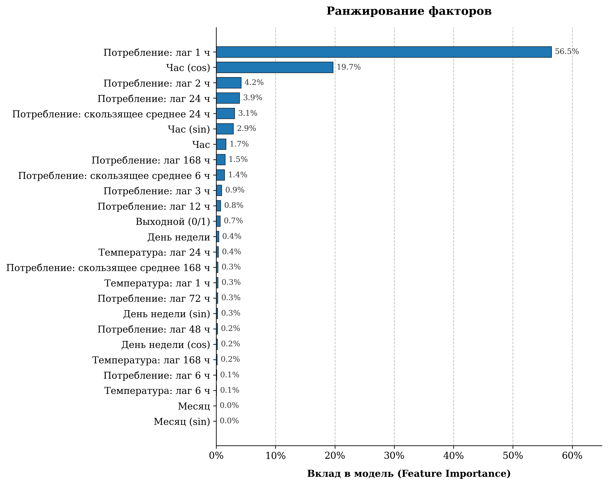
  
<b>图 4.</b> 特征排序与特征对模型的贡献 / <i>Fig. 4. Factor ranking and feature contributions to the model</i>

&emsp;&emsp;sin 和 cos 特征用于考虑企业用电的周期性特征。负荷按一天中的小时、一周中的天和一年中的月份重复。例如，23:00 和 00:00 是相邻的时间点，从用电模式来看，这两个小时比 23:00 和 12:00 更接近。然而在数值记录小时时，这一事实并未得到体现。使用 sin 和 cos 可以在无断点的情况下表示这种周期性，从而更准确地描述日历因素对用电量的影响。图 4 显示，根据现有数据对用电量影响程度的排序，“小时 (cos)”因素位居第二，“小时 (sin)”因素位居第六。

&emsp;&emsp;对各组因素进行了系统性的组间排序分析。结果如图 5 所示。

  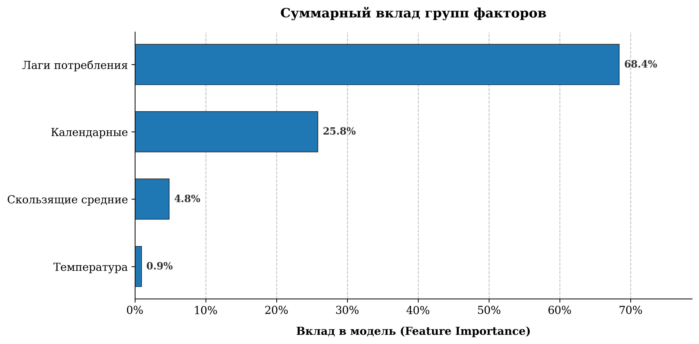
  
<b>图 5.</b> 按组划分的特征排序 / <i>Fig. 5. Factor ranking by group</i>

&emsp;&emsp;需要说明的是，用电是一个由人类社会活动决定的周期性过程，因此根据现有数据，用电行为的历史滞后特征比气候特征对目标依赖变量具有更大的影响。

<h2 align="center" style="border-bottom: none; border: none;">初始样本划分与回归模型训练</h2>

&emsp;&emsp;初始数据样本按时间顺序进行了划分，以避免所谓的“窥探未来”（数据泄漏 / data leakage）：
- **训练集 (train)** – 主体数据（前 ~90% 的数据）；
- **验证集 (validation)** – 接下来的 9% 的数据，用于模型超参数调优和质量评估；
- **测试集 (test)** – 最后 168 小时（24 小时、72 小时、168 小时），用于最终评估模型的质量与适用性，并检验用电量预测的精度。

### 超参数调优
&emsp;&emsp;针对所研究的模型，通过实验确定了 168 小时的预测界限。训练轮数（Epochs）在 20 到 60 之间变化。精度评估基于 RMSE 损失函数。表 1 展示了模型主要超参数的数值及其说明。

&emsp;&emsp;**CatBoost (Gradient Boosting).** 使用梯度提升算法作为基线方案（Baseline）。树深度（Depth = 6）：选择了偏差与方差之间的中间值。在现有样本上，更深的树（Depth = 8–10）会导致模型迅速过拟合。迭代次数（1000）：在学习率（Learning Rate）为 0.03 时，足以保证损失函数收敛。

&emsp;&emsp;**N-HiTS (Neural Hierarchical Interpolation).** 模型基于通过具有不同采样频率的分支（stacks）进行分层预测。池化尺寸 ([8, 4, 1]) 是核心超参数。第一个模块（kernel size = 8）平滑输入数据以捕捉趋势；第二个模块 (4) 对中期波动建模；第三个模块 (1) 针对原始信号工作以恢复高频细节。MLP 宽度 (512)：使用较宽的全连接层使模型能够逼近复杂的非线性依赖关系。

#### 表 1. 模型主要超参数 / Table 1. Core model hyperparameters.

| 模型 | 超参数 | 数值 | 说明 |
| :--- | :--- | :---: | :--- |
| **CatBoost** | Iterations | 1000 | 集成树的数量 |
| **CatBoost** | Depth | 6 | 决策树深度 |
| **CatBoost** | Learning Rate | 0.03 | 学习率 (eta) |
| **N-HiTS** | n_stacks | 3 | 频率模块数量 |
| **N-HiTS** | Pooling Sizes | [8, 4, 1] | 分层插值核尺寸 |
| **N-HiTS** | MLP Width | 512 | 隐藏层维度 |
| **PatchTST** | Patch Length | 16 | 切片（Token）长度 |
| **PatchTST** | Stride | 8 | 切片步长 (50% 重叠) |
| **PatchTST** | d_model | 128 | 嵌入维度 |
| **TFT** | Hidden Size | 64 | 隐藏状态维度 |
| **TFT** | LSTM Layers | 2 | 循环网络层数 |
| **TFT** | Attention Heads | 4 | 注意力机制头数 |

&emsp;&emsp;**PatchTST (Patch Time Series Transformer).** 将时间序列视为切片（Patch）序列的 Transformer 模型架构。切片长度 (16) 与步长 (8)：时间序列被划分为长度为 16 小时的片段。步长（stride）等于 8 可确保相邻 Patch 之间有 50% 的重叠，从而保持连续性并消除切片边界处的瑕疵。

&emsp;&emsp;**TFT (Temporal Fusion Transformer).** 结合注意力机制与 LSTM 的混合模型架构。Hidden Size (64)：隐藏空间维度有意限制为 64。实验表明，增加到 128 或 256 会使训练时间成倍增加，但精度提升微乎其微。LSTM Layers (2)：双层编码器，用于在数据传输到 Self-Attention 模块之前捕捉局部时间动态。

<h2 align="center" style="border-bottom: none; border: none;">质量评估标准与模型选择</h2>

&emsp;&emsp;在训练集上，各模型均展现出损失函数的收敛性。CatBoost 模型表现出最平稳的误差下降，且无过拟合迹象。复杂的神经网络模型（特别是 PatchTST）表现出不稳定（Loss 函数波动较大），这表明在单变量时间序列上，Transformer 需要更大的数据量或更精细的超参数调优。模型质量评估结果汇总于表 2 中。

&emsp;&emsp;与其他模型相比，CatBoost 模型在现有数据上取得了最佳效果，这说明梯度提升算法对于具有显著季节性和日历依赖性的任务具有极高的有效性。TFT 模型取得了第二好的成绩，但值得注意的是，在 168 小时的预测周期内，其误差相比 72 小时有所降低，这说明该模型具备描述周周期的能力。此外还需要指出的是，随着预测周期延长至 168 小时，PatchTST 模型的质量出现明显劣化（决定系数 $R^2$ 降至 0.88），这表明在没有足够训练样本数据的情况下，Transformer 架构在长期预测中存在困难。

#### 表 2. 模型质量评估结果 / Table 2. Model performance evaluation results.

| 预测周期 | 模型 | MAE | RMSE | MAPE (%) | $R^2$ |
| :---: | :--- | :---: | :---: | :---: | :---: |
| 24 小时 | N-HiTS | 120.81 | 145.75 | 2.01 | 0.96 |
| 24 小时 | PatchTST | 139.53 | 162.84 | 2.27 | 0.95 |
| 24 小时 | TFT | 69.15 | 87.03 | 1.13 | 0.99 |
| **24 小时** | **CatBoost** | **38.25** | **46.24** | **0.62** | **1.00** |
| 72 小时 | N-HiTS | 127.58 | 151.11 | 2.15 | 0.95 |
| 72 小时 | PatchTST | 147.78 | 175.12 | 2.42 | 0.94 |
| 72 小时 | TFT | 78.99 | 107.41 | 1.32 | 0.98 |
| **72 小时** | **CatBoost** | **39.23** | **47.19** | **0.65** | **1.00** |
| 168 小时 | N-HiTS | 132.03 | 157.73 | 2.19 | 0.95 |
| 168 小时 | PatchTST | 203.06 | 241.52 | 3.27 | 0.88 |
| 168 小时 | TFT | 73.56 | 103.33 | 1.22 | 0.98 |
| **168 小时** | **CatBoost** | **41.28** | **50.67** | **0.68** | **0.99** |

&emsp;&emsp;图 6 展示了各模型在损失函数动态及预测误差离散度方面的图形对比结果。CatBoost 展现出单调的误差下降。该模型在达到 40% 迭代次数时进入平稳期，这说明其结果具备可预测性。Transformer 模型（PatchTST、N-HiTS）表现出较高的 Loss 函数波动性。特别是 PatchTST 的曲线表明，在现有的数据量下，该模型无法找到稳定的全局极小值。验证集上的残差（误差）分布分析显示：CatBoost 模型具有最窄的四分位距，这意味着误差方差最小。PatchTST 和 N-HiTS 模型则具有包含大量离群点的“宽”分布。

  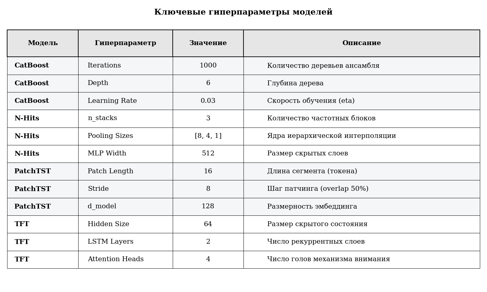
  
<b>图 6.</b> 基于损失函数及预测误差离散度的模型对比 / <i>Fig. 6. Model comparison by loss function and forecast error distribution</i>

&emsp;&emsp;表 3 中按标准差 $\sigma$ 数值进行的模型对比进一步证实了当前的计算与分析结果。

#### 表 3. 基于均方误差与标准差数值的模型对比 / Table 3. Model comparison based on mean squared error and standard deviation.

| 模型 | 标准差 ($\sigma$) |
| :--- | :---: |
| **CatBoost** | **0.012** |
| TFT | 0.058 |
| N-HiTS | 0.142 |
| PatchTST | 0.2015 |

&emsp;&emsp;CatBoost 较低的 $\sigma$ 值表明收敛稳定，而 PatchTST 模型较高的数值则说明训练过程存在较大波动。

&emsp;&emsp;基于上述研究，最终选择 CatBoost 模型作为用电量预测的最佳模型。

<h2 align="center" style="border-bottom: none; border: none;">每日逐时用电量预测</h2>

&emsp;&emsp;基于所研究的人工智能模型，针对 24 – 72 – 168 小时的不同预测周期进行了用电量预测计算。预测结果如图 7–9 所示。

&emsp;&emsp;在“未来一日（24小时）”预测周期内，CatBoost 模型展现出优于其他模型的性能。平均绝对百分比误差（MAPE）为 0.62%，这在电力消费预测任务中属于极高精度水平。TFT 模型的误差为 1.13%。N-HiTS 和 PatchTST 模型表现落后，MAPE 误差超过 2.0%，这反映出 Transformer 架构在短周期上超参数调优的复杂性。

&emsp;&emsp;当预测周期延长至 72 小时（三天）时，是对模型抗误差累积稳健性的一次检验。CatBoost 证实了其稳健性：指标仅轻微下滑。这表明该模型有效地利用了滞后特征与日历因素。

  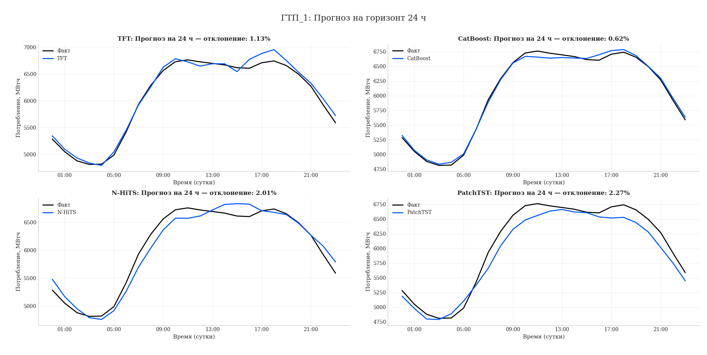
  
<b>图 7.</b> 24 小时用电量预测 / <i>Fig. 7. 24-hour electricity consumption forecasting</i>

  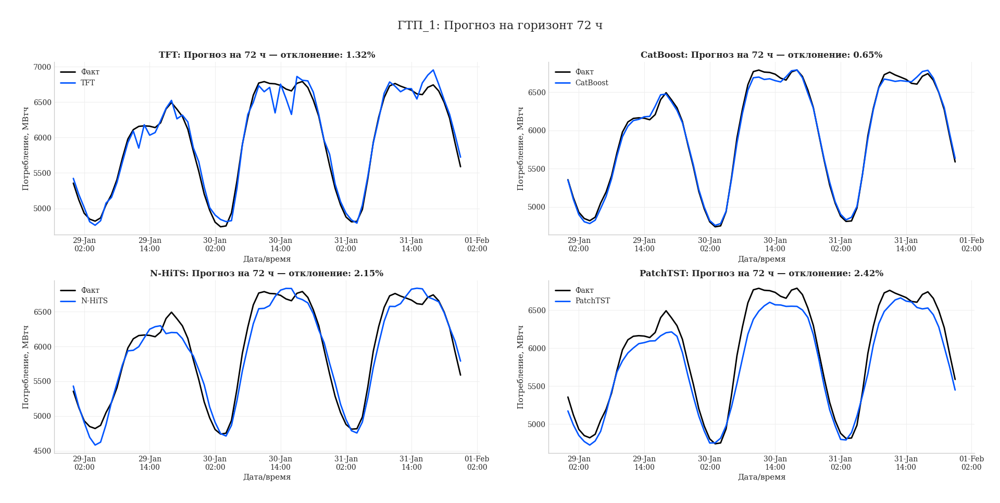
  
<b>图 8.</b> 72 小时用电量预测 / <i>Fig. 8. 72-hour electricity consumption forecasting</i>

  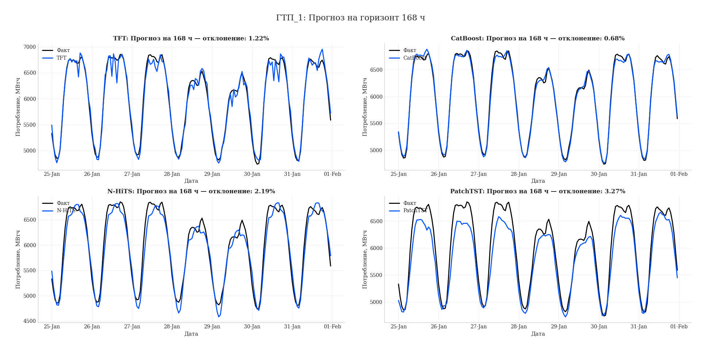
  
<b>图 9.</b> 168 小时用电量预测 / <i>Fig. 9. 168-hour electricity consumption forecasting</i>

&emsp;&emsp;值得注意的是 TFT 模型的表现：在 168 小时预测周期内，其 RMSE 误差 (103.33) 低于 72 小时周期 (107.41)。这归因于 Temporal Fusion Transformer 的架构能够有效表征周周期。PatchTST 模型则表现出急剧的质量下滑：决定系数降至 0.88，MAPE 误差上升至 3.27%。这证实了该架构在现有数据上的不稳定特性。

<h2 align="center" style="border-bottom: none; border: none;">残差 (Residuals) 统计系统分析与诊断</h2>

&emsp;&emsp;为了评估 CatBoost 模型的质量，根据公式 (2) 计算并对预测残差进行了系统分析：

$$
\text{Residuals} = Y_{\text{forecast}} - Y_{\text{actual}}
$$

&emsp;&emsp;对测试周（168 小时）误差序列的统计诊断特性分析得出以下结果：
1. **系统误差 (Bias)** – 残差均值为 8.14 MWh。考虑到样本平均用电量超过 4600 MWh，预测的相对偏差小于 0.2%。这表明模型不存在显著的系统性高估或低估用电量的情况。
2. **误差方差** – 残差标准差 ($\sigma$) 为 50.16 MWh。该数值表征了误差的平均离散程度，用于构建置信区间。
3. **分布形态：**
   - *偏度 (Skewness)* – -0.0283。数值几乎为零，表明误差分布具有对称性（正负误差的数量达到平衡）。
   - *峰度 (Kurtosis)* – 0.0751。接近于零的数值证实分布的“拖尾”符合正态分布律（没有异常高频出现的极端误差）。

&emsp;&emsp;图 10 中展示的残差分布直方图在视觉上证实了以零附近为中心的高斯钟形曲线。

  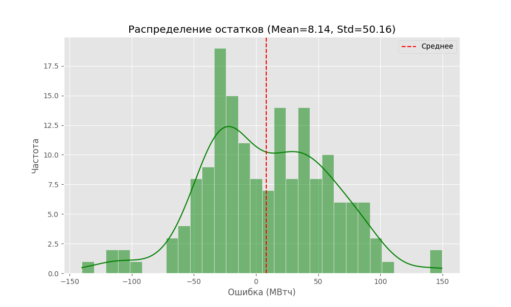
  
<b>图 10.</b> 残差分布直方图 / <i>Fig. 10. Histogram of residual distribution</i>

&emsp;&emsp;为了验证模型的统计可靠性，进行了一系列统计检验。

&emsp;&emsp;**残差正态分布检验 (Normality Test)。** 采用 Shapiro-Wilk 检验，结果如下：$W = 0.9871$，$p$-value $= 0.1249$。由于 $p$-value $> 0.05$（显著性水平），未拒绝残差服从正态分布的原假设。图 11 展示的 Q-Q Plot 表明残差散点几乎紧贴理论直线，同样证实了正态性。

  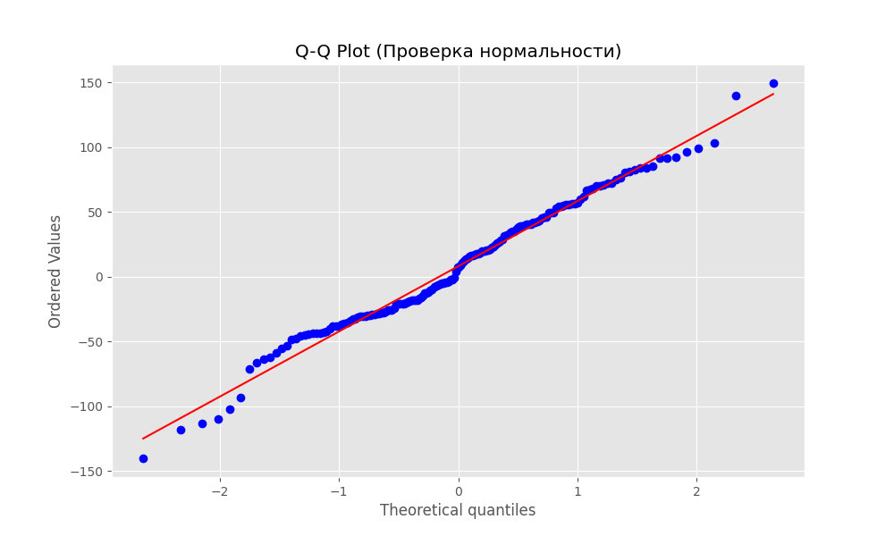
  
<b>图 11.</b> 残差正态分布检验图形结果 / <i>Fig. 11. Graphical results of the residual normality test</i>

&emsp;&emsp;**残差自相关检验 (Autocorrelation)。** 针对误差独立性假设，使用了 Ljung-Box Q 检验及自相关函数（ACF）分析（图 12）。结果在残差 24 小时和 48 小时滞后项上获得了 $p$-value $< 0.05$。因此，由于用电量复杂的日内结构未能被模型完全捕获，残差中保留了周期性依赖关系。然而，考虑到总体误差较小（MAPE 0.68%）且分布正态性已获证实，残差中的自相关对于电力企业和工业企业在实际用电预测中的模型应用并不构成致命影响。

  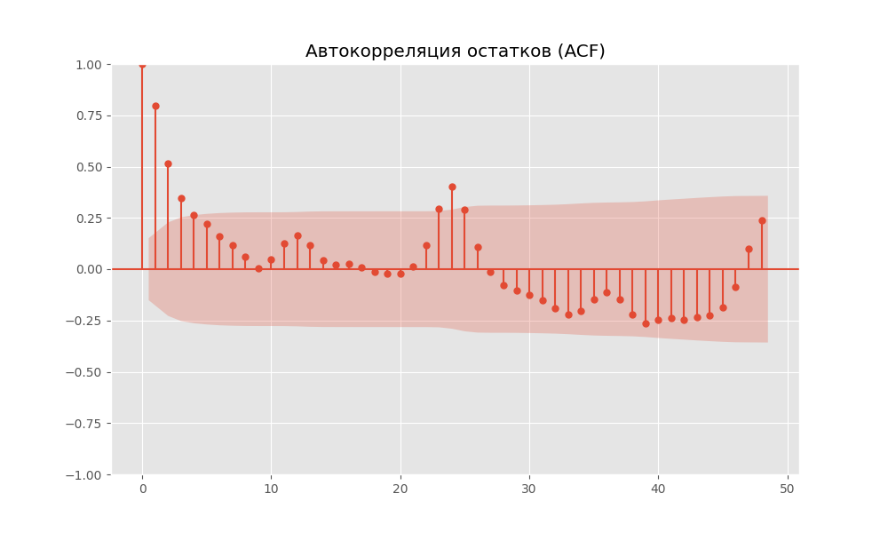
  
<b>图 12.</b> 残差自相关函数 (ACF) 图像 / <i>Fig. 12. Autocorrelation function (ACF) plot for residuals</i>

&emsp;&emsp;**残差同方差性评估。** 图 13 中关于残差随时间变化的动态分析表明，在整个预测期间误差方差保持相对常数。没有出现明显的误差走廊扩大现象，说明模型无论在何种负荷水平下均具备稳定性。

  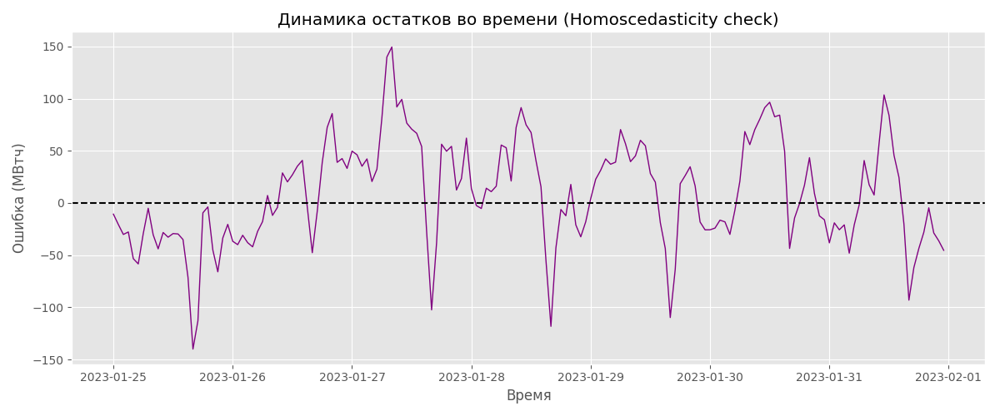
  
<b>图 13.</b> 残差同方差性评估图形结果 / <i>Fig. 13. Graphical assessment of residual homoscedasticity</i>

&emsp;&emsp;适用性评估结果表明，CatBoost 模型被认定在统计上是适用的。残差的正态性允许为企业用电预测评估合理构建概率置信区间。

<h2 align="center" style="border-bottom: none; border: none;">结论</h2>

&emsp;&emsp;本文对用于构建与调优逐时用电预测模型的现代机器学习和人工智能方法进行了系统统计分析。针对俄罗斯某电力企业的实际数据，给出了每种模型超参数调优的合理依据。提供了科学证据，证明在解决企业真实数据用电预测任务中，从候选模型集中选出 CatBoost 为最佳回归模型。

&emsp;&emsp;该任务对于制定工业企业参与批发电力与容量市场的用电预测申报以及选择国家电力系统负荷模式具有重要意义。该问题的解决通过将预测误差平均降低至 1% 以内，为企业节省了巨额资金成本。

&emsp;&emsp;合理的建模方法与 CatBoost 模型在数据分析中表现为解决每日逐时用电量预测任务的有效人工智能工具。

&emsp;&emsp;系统数据分析与所探讨的机器学习方法表明，多目标预测任务可简化为采用 CatBoost 模型，该模型既能表征现有数据，又能捕获目标过程的变化。本研究得出的所有理论结论均得到了计算结果的验证。

&emsp;&emsp;未来计划在候选模型集中加入其他机器学习与人工智能方法。后续研究方向在于改进与完善数据处理方法，使所选回归模型更好地适应数据的动态变化。

<h2 align="center" style="border-bottom: none; border: none;">参考文献</h2>

1. **Karpenko S. M., Karpenko N. V., Yematin E. A., Marat Sh.** Planning electricity consumption of an industrial enterprise in the wholesale electricity market conditions // *Energy Safety and Energy Saving*. 2024. No. 6. Pp. 35–40. EDN: CKFPVC

2. **Karpenko S. M., Karpenko N. V., Yematin E. A., Dzhundzhu D.** Multifactor statistical analysis of indicators of the wholesale electricity market (on the example of a price zone) // *Energy Safety and Energy Saving*. 2024. No. 4. Pp. 37–42. EDN: QBTQHW

3. **Byk F. L., Myshkina L. S.** Economic efficiency of modern electric power industry // *Energetik*. 2022. No. 1. Pp. 17–21. EDN: OGTFOW

4. **Hong T., Fan S.** Probabilistic electric load forecasting: A Tutorial Review. *International Journal of Forecasting*. 2016. Vol. 32. No. 3. Pp. 914–938. DOI: 10.1016/j.ijforecast.2015.11.011

5. **Dudek G.** Pattern-based local linear regression models for short-term load forecasting. *Electric Power System Research*. 2016. No. 130. Pp. 139–147. DOI: 10.1016/j.epsr.2015.09.001

6. **Gochhait S., Sharma D.K.** Regression model-based short-term load forecasting for load despatch centre. *Journal of Applied Engineering and Technological Science*. 2023. Vol. 4(2). Pp. 693–710. DOI: 10.37385/jaets.v4i2.1682

7. **Lee M.H.L., Ser Y.C., Selvachandran G., Pham T.H.** A comparative study of forecasting electricity consumption using machine learning models. *Mathematics*. 2022. Vol. 10. Article 1329. DOI: 10.3390/math10081329

8. **Dayarathna M., Wen Yo., Fan Rui.** Data center energy consumption modeling: a survey. *IEEE Communications Surveys & Tutorials*. 2016. Vol. 18. No. 1. DOI: 10.1109/COMST.2015.2481183

9. **Mughees M., Li Y., Chen Y., Li Y.R.** Short-term load forecasting for ai-data center. *IEEE PES General Meeting 2025*. Electrical Engineering and Systems Science. 2025. DOI: 10.48550/arXiv.2503.07756

10. **Ye Z., Gao W., Hu Q. et al.** Deep learning workload scheduling in GPU datacenters: A survey. *ACM Computing Surveys*. 2024. Vol. 56. No. 6. Pp. 1–38. DOI: 10.1145/3638757

11. **Munkhammar J., Meer D., Widén J.** Very short term load forecasting of residential electricity consumption using the Markov-chain mixture distribution (MCM) model. *Applied Energy*. 2021. 282(A):116180. DOI: 10.1016/j.apenergy.2020.116180

12. **Hippert H.S., Pedreira C.E., Souza R.C.** Neural networks for short-term load forecasting: a review and evaluation. *IEEE Transactions on Power Systems*. Vol. 16. No. 1. Pp. 44–55. 2001. DOI: 10.1109/59.910780

13. **Sailor D.J., Munoz J.R.** Sensitivity of electricity and natural gas consumption to climate in the U.S.A. Methodology and results for eight states. *Energy*. 1997. Vol. 22. No. 10. Pp. 987–998. DOI: 10.1016/S0360-5442(97)00034-0

14. **Hong T., Pinson P., Fan S. et al.** Probabilistic energy forecasting: global energy forecasting competition 2014 and beyond. *International Journal of Forecasting*. 2016. Vol. 32. No. 3. Pp. 896–913. DOI: 10.1016/j.ijforecast.2016.02.001

15. **Wang A., Yu Q., Wang J. et al.** Electric load forecasting based on deep ensemble learning. *Applied Sciences*. 2023. Vol. 13. No. 17. P. 9706. DOI: 10.3390/app13179706

16. **Lim B., Arık Ö.S., Loeff N., Pfister T.** Temporal Fusion Transformer for interpretable multi-horizon time series forecasting. *International Journal of Forecasting*. 2021. Vol. 37. No. 1. DOI: 10.1016/j.ijforecast.2021.03.012

17. **Challu C., Olivares K.G., Oreshkin B.N. et al.** N-HiTS: Neural hierarchical interpolation for time series forecasting. *Proceedings of the AAAI Conference on Artificial Intelligence*. 2023. Vol. 37. No. 6. Pp. 6989–6997. DOI: 10.48550/arXiv.2201.12886

18. **Ahmad H., Mortazavi S.K., Bahnasawi M.E. et al.** Enhanced time series forecasting: integrating PatchTST with BERT Layers. *Conference: 5th International Conference on Applied Mathematics & Computer Science (ICAMCS 2025)*. At: Venice, Italy, September 27–29, 2025. DOI: 10.1109/ICAMCS62774.2024.00014

19. **Dorogush A.V., Ershov V., Gulin A.** CatBoost: gradient boosting with categorical features support. DOI: 10.48550/arXiv.1810.11363.2018

20. **Lim B., Arık S.Ö., Loeff N., Pfister T.** Temporal Fusion Transformer for interpretable multi-horizon time series forecasting. *International Journal of Forecasting*. Vol. 37. No. 4. 2021. Pp. 1748–1764. DOI: 10.1016/j.ijforecast.2021.03.012

21. **Nie Y., Nguyen N.H., Sinthong P., Kalagnanam J.** A time series is worth 64 words: long-term forecasting with transformers (PatchTST). *Proceedings of the International Conference on Learning Representations (ICLR 2023)*. https://arxiv.org/pdf/2211.14730.pdf

<h2 align="center" style="border-bottom: none; border: none;">补充信息</h2>

### 利益冲突
&emsp;&emsp;作者声明不存在利益冲突。

### 作者贡献
&emsp;&emsp;**А. Э. 兹戈耶夫** – 课题指导、任务提出、真实数据搜集与预处理、用电量预测、结果解释、模型质量与适用性评估、回归模型开发、结果撰写、基于电力企业真实数据的模型测试；  
&emsp;&emsp;**Е. В. 克里姆金** – 回归模型开发、模型超参数调优、模型训练、计算执行、Python 程序代码编写、计算结果图表绘制、模型残差检验；  
&emsp;&emsp;**В. В. 切尔尼亚乌斯卡斯** – 数据分析、数据集准备、自相关评估；  
&emsp;&emsp;**А. В. 布莱洛夫斯基** – 模型质量指标计算、模型质量检验、异方差性评估；  
&emsp;&emsp;**Р. Н. 雷津科夫** – 数学模型适用性检验、MAPE (%) 预测误差计算。

### 资助
&emsp;&emsp;本研究未获得任何赞助支持。

### 作者简介
* **阿兰·爱德华多维奇·兹戈耶夫 (Alan Eduardovich Dzgoev)**，技术科学副博士，副教授，MIREA – 俄罗斯技术大学信息技术学院数字化转型教研室副教授；119454，俄罗斯，莫斯科，韦尔纳茨基大街 78 号；`dzgoev@mirea.ru`，ORCID: [0000-0002-1314-6151](https://orcid.org/0000-0002-1314-6151)，SPIN 码: 8092-8784
* **叶戈尔·弗拉基米罗维奇·克里姆金 (Egor Vladimirovich Klimkin)**，本科生，MIREA – 俄罗斯技术大学信息技术学院应用数学系；119454，俄罗斯，莫斯科，韦尔纳茨基大街 78 号；`KlimkinEVK@yandex.ru`，ORCID: [0009-0001-3876-3041](https://orcid.org/0009-0001-3876-3041)，SPIN 码: 7018-6703
* **弗拉季斯拉夫·维陶托维奇·切尔尼亚乌斯卡斯 (Vladislav Vitautovich Chernyauskas)**，高级讲师，MIREA – 俄罗斯技术大学信息技术学院数字化转型教研室；119454，俄罗斯，莫斯科，韦尔纳茨基大街 78 号；`chernyauskas-vladislav@yandex.ru`，ORCID: [0009-0002-8438-3418](https://orcid.org/0009-0002-8438-3418)，SPIN 码: 5867-6366
* **安德烈·瓦列里耶维奇·布莱洛夫斯基 (Andrey Valerievich Brailovsky)**，助教，MIREA – 俄罗斯技术大学信息技术学院数字化转型教研室；119454，俄罗斯，莫斯科，韦尔纳茨基大街 78 号；`brajlovskij@mirea.ru`，ORCID: [0009-0006-1794-7825](https://orcid.org/0009-0006-1794-7825)，SPIN 码: 5900-1835
* **罗曼·尼古拉耶维奇·雷津科夫 (Roman Nikolaevich Rezenkov)**，技术科学副博士，副教授，MIREA – 俄罗斯技术大学信息技术学院数字化转型教研室副教授；119454，俄罗斯，莫斯科，韦尔纳茨基大街 78 号；`rezenkov@mirea.ru`，ORCID: [0009-0005-5542-2125](https://orcid.org/0009-0005-5542-2125)
